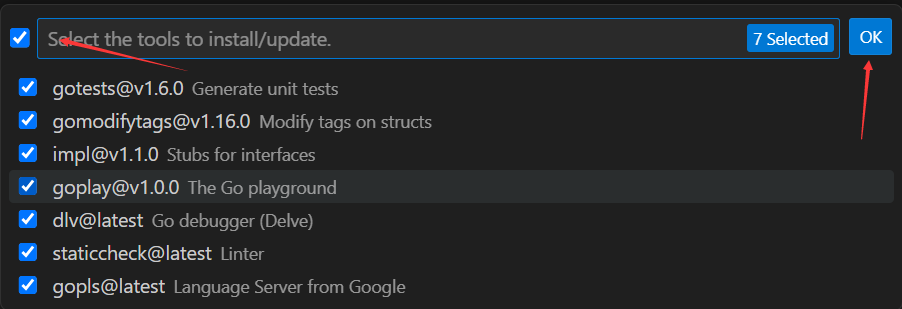
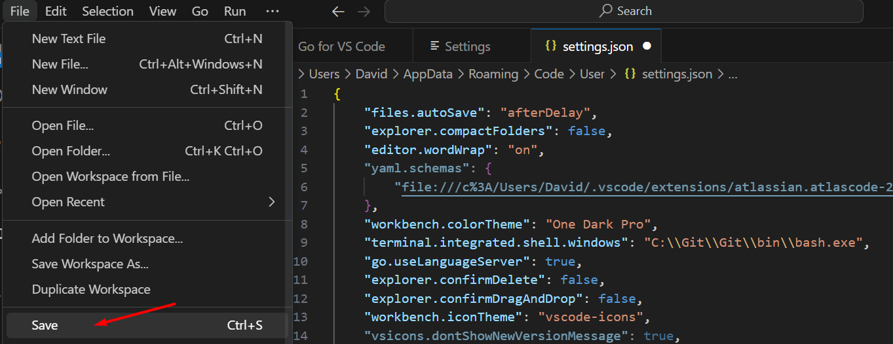

# Go开发环境搭建

# 1. 安装环境和依赖包

```bash
# Windows平台
# Go 1.18.8
# Git Windows版本
# VSCode
```

# 2. 安装步骤

## 2.1 安装Go

```bash
下载链接: https://go.dev/dl/
```


```bash
双击安装到指定目录 C:\Program Files\Go\
```


**$GOPATH**


**$GOPATH/bin**


```bash
PS C:\Users\David> go version
go version go1.18.8 windows/amd64
```

**$GOROOT/bin**


```bash
PS C:\Users\David> go env    
set GO111MODULE=off  # 改为on
set GOARCH=amd64
set GOBIN=
set GOCACHE=C:\Users\David\AppData\Local\go-build
set GOENV=C:\Users\David\AppData\Roaming\go\env
set GOEXE=.exe
set GOEXPERIMENT=
set GOFLAGS=
set GOHOSTARCH=amd64
set GOHOSTOS=windows
set GOINSECURE=
set GOMODCACHE=C:\Users\David\go\pkg\mod
set GONOPROXY=
set GONOSUMDB=
set GOOS=windows
set GOPATH=C:\Users\David\go
set GOPRIVATE=
set GOPROXY=https://proxy.golang.org,direct
set GOROOT=C:\Program Files\Go
set GOSUMDB=sum.golang.org
set GOTMPDIR=
set GOTOOLDIR=C:\Program Files\Go\pkg\tool\windows_amd64
set GOVCS=
set GOVERSION=go1.18.8
set GCCGO=gccgo
set GOAMD64=v1
set AR=ar
set CC=gcc
set CXX=g++
set CGO_ENABLED=1
set GOMOD=
set GOWORK=
set CGO_CFLAGS=-g -O2
set CGO_CPPFLAGS=
set CGO_CXXFLAGS=-g -O2
set CGO_FFLAGS=-g -O2
set CGO_LDFLAGS=-g -O2
set PKG_CONFIG=pkg-config
set GOGCCFLAGS=-m64 -mthreads -fno-caret-diagnostics -Qunused-arguments -fmessage-length=0 -fdebug-prefix-map=C:\Users\David\AppData\Local\Temp\go-build4102564375=/tmp/go-build -gno-record-gcc-switches

PS C:\Users\David> go env GO111MODULE
off
PS C:\Users\David> go env -w GO111MODULE=on
PS C:\Users\David> go env GO111MODULE      
on
```

## 2.2 安装Git

```bash
下载链接: https://git-scm.com/downloads
```


```bash
下载后, 双击安装到指定目录 C:\Program Files\Git
Git环境变量: C:\Program Files\Git\cmd
```

## 2.3 安装VSCode

```bash
下载连接: https://code.visualstudio.com/Download
```

```bash
双击后安装到指定目录 C:\Users\David\AppData\Local\Programs\Microsoft VS Code
VSCode环境变量: C:\Users\David\AppData\Local\Programs\Microsoft VS Code\bin
```

# 3. VSCode搭建Go开发环境

## 3.1 安装Go插件


## 3.2 安装辅助插件





```bash
# 注意: 在使用GO MODULE工程结构时, 执行go get或者go install, 要进入到项目根目录下执行.
# 先进入项目根目录, 然后手动安装插件也可以
go install -v golang.org/x/tools/gopls@latest
go install -v honnef.co/go/tools/cmd/staticcheck@latest
go install -v github.com/go-delve/delve/cmd/dlv@latest
go install -v github.com/haya14busa/goplay/cmd/goplay@latest
go install -v github.com/josharian/impl@latest
go install -v github.com/fatih/gomodifytags@latest
go install -v github.com/cweill/gotests/gotests@latest
go install -v github.com/ramya-rao-a/go-outline@latest
go install -v github.com/uudashr/gopkgs/v2/cmd/gopkgs@latest
```

## 3.3 配置VSCode使用Git Bash终端

打开一个终端


选择Configure Terminal Settings


```go
{
    "terminal.integrated.automationProfile.windows": {
        
    }
}


// 替换json文件为如下, 之后重启VScode, 默认的终端就是Git bash了

{
    "files.autoSave": "afterDelay",
    "explorer.compactFolders": false,
    "editor.wordWrap": "on",
    "yaml.schemas": {
        "file:///c%3A/Users/David/.vscode/extensions/atlassian.atlascode-2.8.5/resources/schemas/pipelines-schema.json": "bitbucket-pipelines.yml"
    },
    "workbench.colorTheme": "One Dark Pro",
    "terminal.integrated.shell.windows": "C:\\Git\\Git\\bin\\bash.exe",
    "go.useLanguageServer": true,
    "explorer.confirmDelete": false,
    "explorer.confirmDragAndDrop": false,
    "workbench.iconTheme": "vscode-icons",
    "vsicons.dontShowNewVersionMessage": true,
    "http.proxySupport": "off",
    "go.toolsManagement.autoUpdate": true,
    "terminal.integrated.tabs.enabled": true,
    "terminal.integrated.defaultProfile.windows": "Git Bash",
    "git.autofetch": true,

}
```



重启VSCode


## 3.4 VSCode其他配置

自动保存


目录垂直层级


垂直目录层级间隔


Auto Save


## 3.5 其他辅助插件安装

- 快捷运行代码的插件: Code Runner, 运行代码只需右键, 选择Run Code


- Git工具: Gitlens, 安装后会在VSCode终端集成Git功能


# 4. 项目初始化

```bash
David@LAPTOP-IPBQSBUE MINGW64 /e/Study/Go_Bilibili/code/go_demo
$ go mod init github.com/goeasy2022/go_demo
go: creating new go.mod: module github.com/goeasy2022/go_demo

David@LAPTOP-IPBQSBUE MINGW64 /e/Study/Go_Bilibili/code/go_demo
$ cat go.mod 
module github.com/goeasy2022/go_demo

go 1.18
```

# 5. Go程序编写

创建main.go代码


```go
// main.go

package main

import "fmt"

func main() {
	fmt.Println("Hello World!")
}
```

执行main.go代码


创建sum功能

一个Go项目一般只有一个main.go, 也就是一个package main作为程序执行的入口. 其余的目录内的package, 一般都以该目录的名称也就是该目录所开发的功能命名.

- 在sum目录中也可以使用package main, 不过仅限于学习阶段. 在不同的目录内使用package main, 这样就可以分别单独运行代码, 而无需每次都回到main.go运行代码

```go
// sum.go

package main

import "fmt"

func main() {
	fmt.Println("sum")
}
```


- 也可以在sum目录内, 直接创建package sum, 然后回到main.go去调用package sum

```go
// sum.go

package sum


func Add(a int, b int) int {
	var sum int = a + b
	return sum
}
```


```go
// main.go中调用package sum

package main

import (
	"fmt"

	"github.com/goeasy2022/go_demo/sum"
)

func main() {
	fmt.Println("Hello World!")
	var a int = 1
	var b int = 2
	var c int = sum.Add(a, b)
	fmt.Println(c)

}
```


执行main.go


# 6. Git项目

```bash
David@LAPTOP-IPBQSBUE MINGW64 /e/Study/Go_Bilibili/code/go_demo
$ git config --global user.name "davidw"

David@LAPTOP-IPBQSBUE MINGW64 /e/Study/Go_Bilibili/code/go_demo
$ git config --global user.email "goeasy2022@outlook.com"

David@LAPTOP-IPBQSBUE MINGW64 /e/Study/Go_Bilibili/code/go_demo
$ cat ~/.gitconfig
[user]
        name = davidw
        email = goeasy2022@outlook.com
```

```bash
David@LAPTOP-IPBQSBUE MINGW64 /e/Study/Go_Bilibili/code/go_demo
$ ssh-keygen
Generating public/private rsa key pair.
Enter file in which to save the key (/c/Users/David/.ssh/id_rsa): 
Created directory '/c/Users/David/.ssh'.
Enter passphrase (empty for no passphrase):
Enter same passphrase again: 
Your identification has been saved in /c/Users/David/.ssh/id_rsa
Your public key has been saved in /c/Users/David/.ssh/id_rsa.pub
The key fingerprint is:
SHA256:MRKYhgxRjjnowONIOHx2Npeqrlgln14AjX4pnN7Q6hI David@LAPTOP-IPBQSBUE
The key's randomart image is:
+---[RSA 3072]----+
|o=.. o.          |
|=+oo+  ..        |
|O=++.+.oo        |
|*=++o.+. o       |
|.oB *.  S        |
|E. X.o           |
| .+.+ .          |
|oo.. .           |
|.oo..            |
+----[SHA256]-----+
```


```bash
echo "# Go_Bilibili" >> README.md
git init
git add .
git commit -m "first commit"
git branch -M main
git remote add origin git@github.com:goeasy2022/Go_Bilibili.git
git push -u origin main
```


